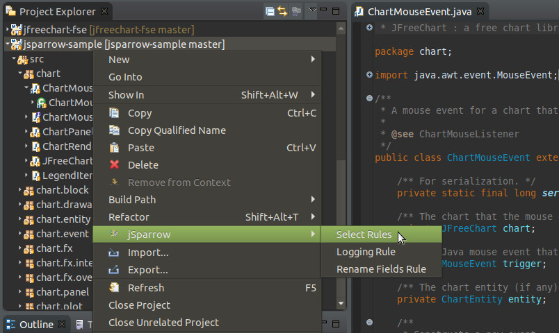
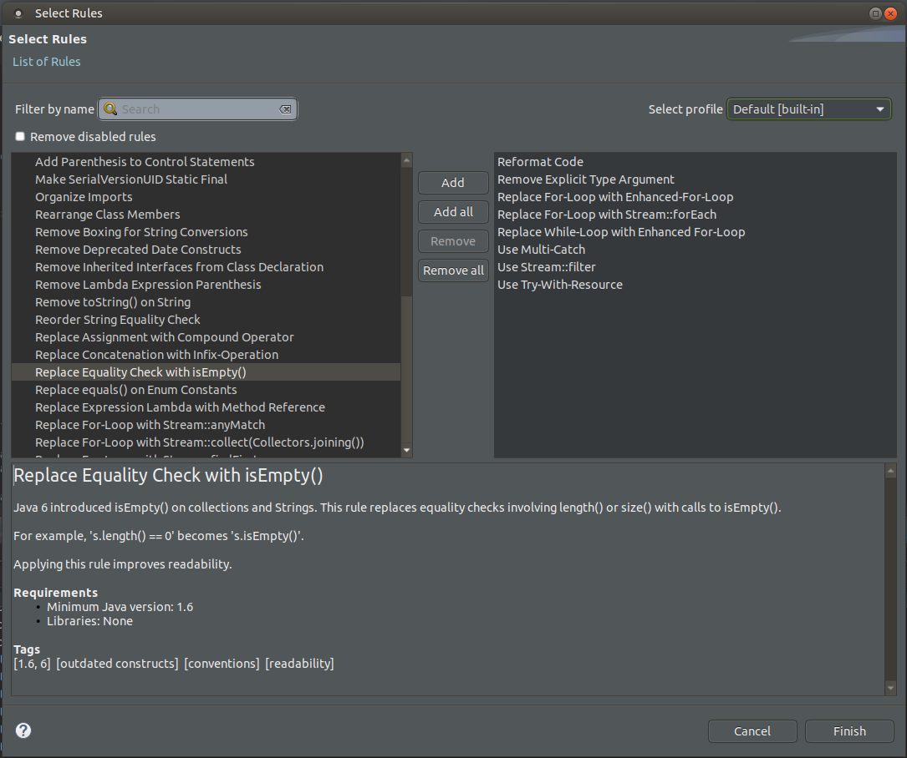
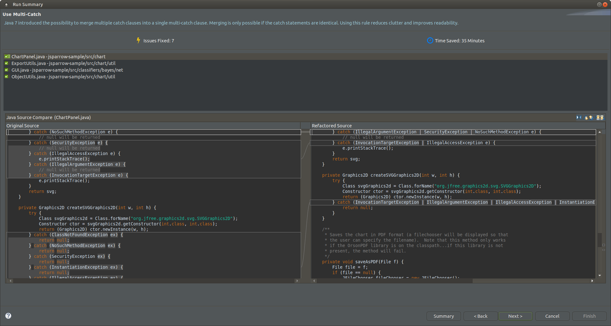
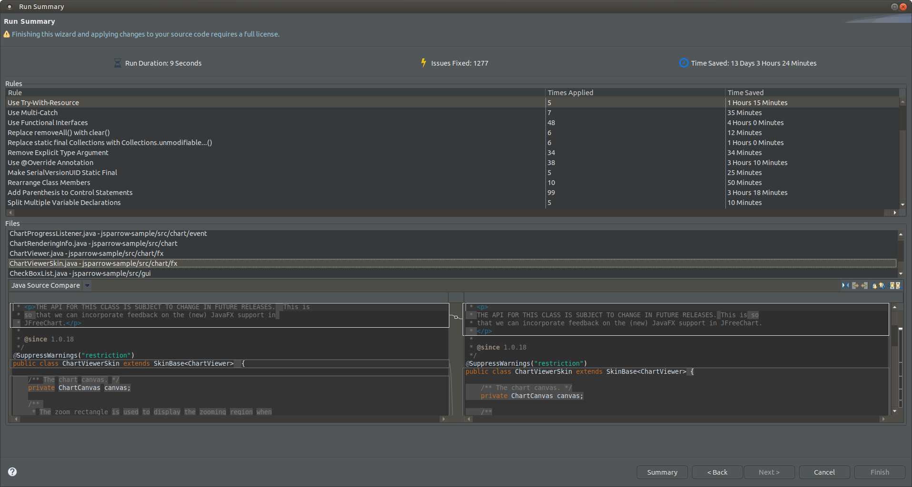

# Getting started

[[toc]]

## Introduction

jSparrow is a eclipse plugin, which automaticaly applies improvements, based on a set of predefined rules, to jour Java codebase.

With the support of screenshots the functionality is explained, by inspecting the following projects with jSparrow:

* JFreeChart - Future State Edition (FSE)
    * https://github.com/jfree/jfreechart-fse
    * GNU License
* Morphia
    * https://github.com/mongodb/morphia
    * Apache License Version 2.0
* StringTemplate 4
    * https://github.com/antlr/stringtemplate4
    * BSD License
* Own test cases

## Usage of the Plugin

The plugin is activated with a right-click in the editor or the package tree. The selection of elements defines which files are used for the improvement process. The following types are supported:
* A project
    * Changes are applied to the whole project
* A package
    * Changes are limited to the selected package, where it is possible to select multiple packages at once
* A Java class file
    * Same functionality as package but on file level
* Java editor
    * Changes are applied to the java class that is in focus of the editor

## Selection of rules

After the execution of “Select rules to apply” a selection window is opened to select the rule set.

Window is split in three parts. On the top is filtering part which makes it easier to find rules you would like to apply.

Middle of the window is divided into two lists. Left list contains available rules and right one contains rules that you want to apply.
You can add desired rules to the right list by simply selecting one or more rules on the left list and selecting the Add button. If you want to apply all the rules, you can do it by just selecting the Add all button.

On the bottom part of the window, the description of currently selected rule is displayed.

### Selection of the profile

Through the drop down menu of the select rules interface it is possible to choose a profile. Change of currently selected profile will discard previously made selection of the rules. By default the predefined profile is used with most common rule set.

::: tip
Profiles can be configured in the preference page.
:::

## Preview of the rules to apply

After selecting rules the preview wizard is displayd, containing changes for each rule, one at a time.

Following elements are in the preview:
* Name of the rule
    * In the left upper corner is the name of current rule
* Short description of the rule
    * Below the name of the rule is a description
* Statistics for the rule
    * Displays how many times the rule was applied, what is estimeted time saved and how much time is saved by applying the rule
* List of changed java classes
    * Shows all the classes that are changed by the rule
* Diff view
    * Left side: old Javacode
    * Right side: new Javacode
* Buttons
    * “Summary”: Skip to the page with statistics summary
    * “Back”: Return to previous rule
    * “Next”: Forward to the next rule
    * “Cancel”: Cancel all changes 
    * “Finish”: Apply all changes

## Additional Options

jSparrow allows the generation of a default profile. The preferences are integrated in eclipse and through “Window” -> ”Preferences” -> ”jSparrow” to reach.

### Default profile

The default profile determines, which rules are pre-selected when starting the rule wizard.
::: tip
The pre selection can still be changed during the rule selection process.
:::

### Filtering rules by a tag

You can filter rules by text or by available tags. Tags group rules by functionality, requirements or any relevant common factor they have.

### Disabled rules

Some rules may not be able for applying on a certain project. Reson for that is one of the following missing requirements:
* Java version too low
* Missing required library
::: tip
Information about unsatisfied requirements will be shown in red color in the rule description part of the select rules wizard.
:::
